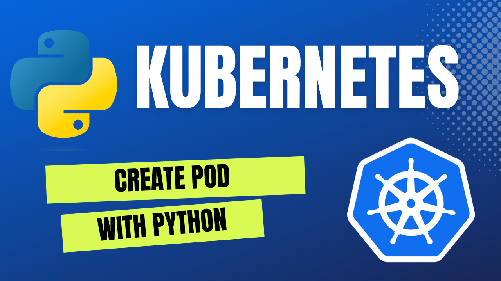

# k8s-guides

Simplified and practical kubernetes guides extracted from real use cases.

## Create Pod on Kubernetes using k8s API and cURL

[Create Pod on Kubernetes using k8s API and cURL](k8s-api-curl.md)

https://youtu.be/oiD80Sxzi4s

https://gist.github.com/warolv/51802de1af07fc881adafb1b99471bae

## Create Pod on Kubernetes using python

[Create Pod on Kubernetes using python](k8s-create-pod-python.md)

