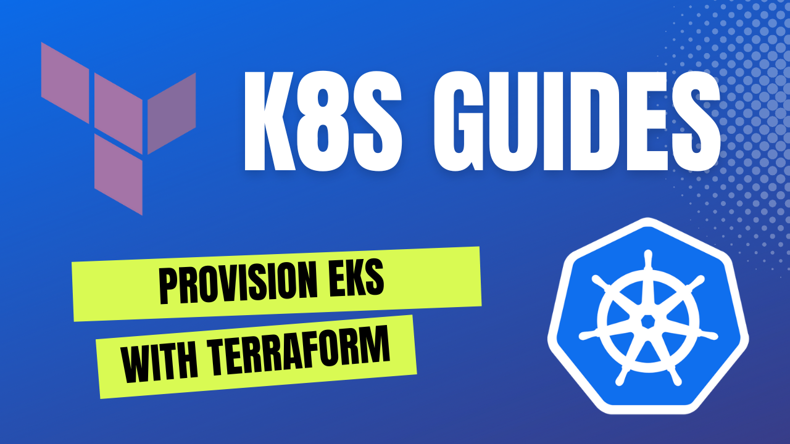

## How to provision EKS cluster with terraform


### Prerequisites: Terraform and existing AWS account


### create TF user in AWS account and save creds

```bash

# export AWS creds to envinronment
export AWS_ACCESS_KEY_ID="AWS_ACCESS_KEY_ID"
export AWS_SECRET_ACCESS_KEY="AWS_SECRET_ACCESS_KEY"
export AWS_DEFAULT_REGION="eu-west-1"
```

### Overview of 'terraform-aws-vpc' module

https://github.com/terraform-aws-modules/terraform-aws-vpc


```terraform
module "vpc" {
  source  = "terraform-aws-modules/vpc/aws"

  name                 = "k8s-guides-vpc"
  cidr                 = "172.16.0.0/16"
  azs                  = data.aws_availability_zones.available.names
  private_subnets      = ["172.16.1.0/24", "172.16.2.0/24"]
  public_subnets       = ["172.16.3.0/24", "172.16.4.0/24"]
  enable_nat_gateway   = true
  single_nat_gateway   = true
  enable_dns_hostnames = true

  tags = {
    Terraform   = "true"
    Environment = "dev"
  }
}
```

Create VPC with 2 private and 2 public subnets
Use Single NAT gateway (Great for dev | staging enironments, not for production)


### Overview of 'terraform-aws-eks' module

https://github.com/terraform-aws-modules/terraform-aws-eks


```terraform
module "eks" {
  source  = "terraform-aws-modules/eks/aws"

  cluster_name    = "k8s-guides-eks"
  cluster_version = "1.24"
  subnet_ids      = module.vpc.private_subnets

  vpc_id = module.vpc.vpc_id

  eks_managed_node_groups = {
    first = {
      desired_capacity = 1
      max_capacity     = 5
      min_capacity     = 1

      instance_type = "t3.medium"
    }
  }
}
```

EKS Cluster version is 1.24
Create Node Group (AWS autoscaling group) of 1 instance, instance_type: t3.medium

### Create EKS with Terraform

```bash
terraform init

terraform plan

terraform apply
```

### How to interact with your cluster?

```bash
aws eks update-kubeconfig --name k8s-guides
```

### Validate everything works by deploying nginx

```
kubectl run nginx-test --image=nginx 
```